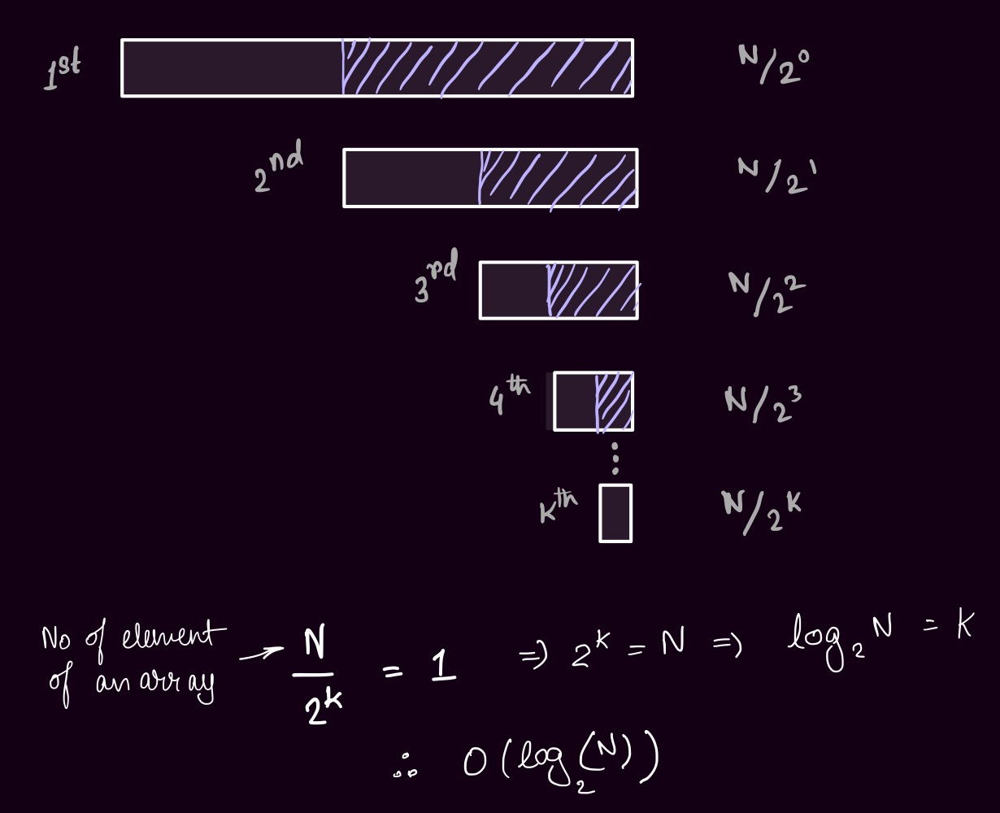
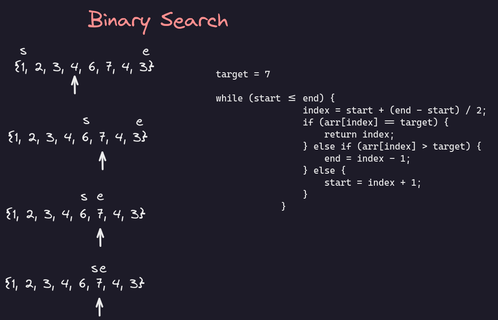

# Binary Search
### Time Complexity :

-   Best Case : $O ( 1 )$
-   Worst Case : $O ( log (n) )$ [ where n is number of element in the array ]



### Steps for Binary Search :

1.  Find the middle element.
2.  Compare the target element with the middle element :
    1.  if target element > middle element :
        1.  if Ascending Array : search in left side of the array.
        2.  if Descending Array : search in right side of the array.
    2.  if target element < middle element :
        1.  if Ascending Array : search in right side of the array.
        2.  if Descending Array : search in left side of the array.
    3.  if target element = middle element :
        1.  return element

-   Q1. Binary Search

	

    ```java
    package com.inclass;
    
    public class BinarySearch {
    
        public static void main(String[] args) {
            int[] arr = {0, 1, 2, 3, 4, 5, 6, 7, 8, 9};
            int target = 3;
            if (arr[0] >= arr[arr.length - 1]) {
                System.out.println(binarySearchDes(arr, target));
            } else {
                System.out.println(binarySearchAsc(arr, target));
            }
        }
    
        // Binary Search for Ascending Sorted Array
        static int binarySearchAsc(int[] arr, int target) {
            int start = 0;
            int end = arr.length - 1;
            int index = 0;
            while (start <= end) {
                index = start + (end - start) / 2;
                if (arr[index] == target) {
                    return index;
                } else if (arr[index] > target) {
                    end = index - 1;
                } else {
                    start = index + 1;
                }
            }
            return -1;
        }
    
        // Binary Search for Descending Sorted Array
        static int binarySearchDes(int[] arr, int target) {
            int start = 0;
            int end = arr.length - 1;
            int index = 0;
            while (start <= end) {
                index = start + (end - start) / 2;
                if (arr[index] == target) {
                    return index;
                } else if (arr[index] < target) {
                    end = index - 1;
                } else {
                    start = index + 1;
                }
            }
            return -1;
        }
    }
    ```