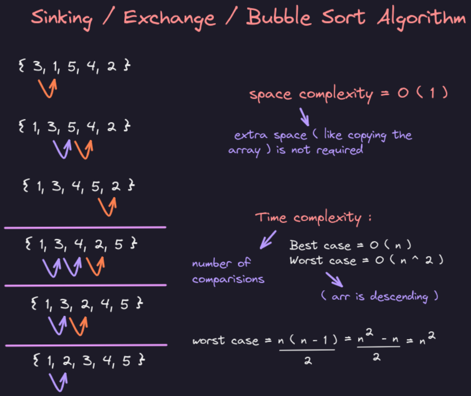
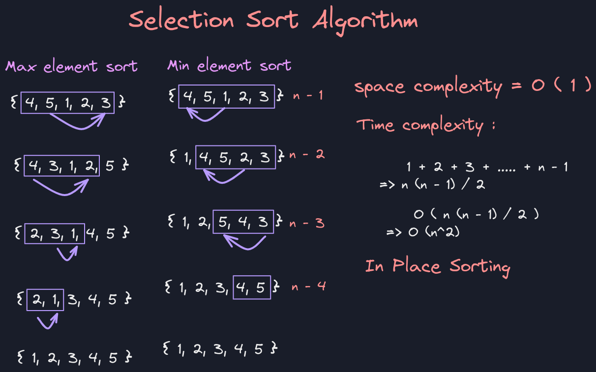
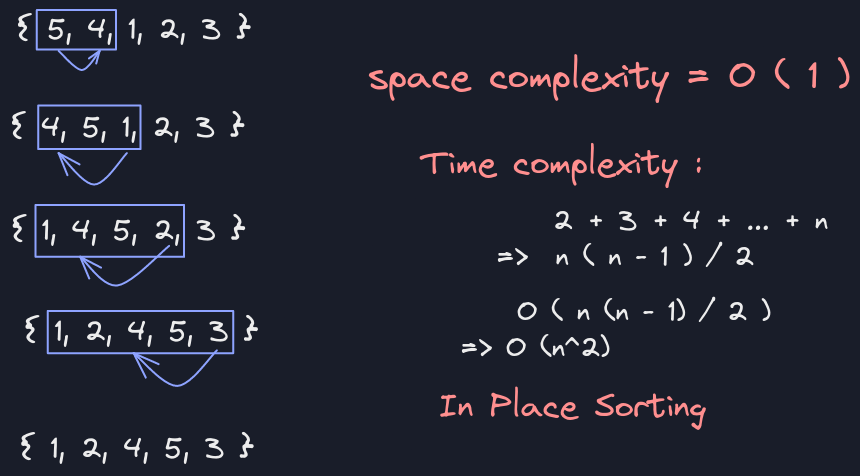
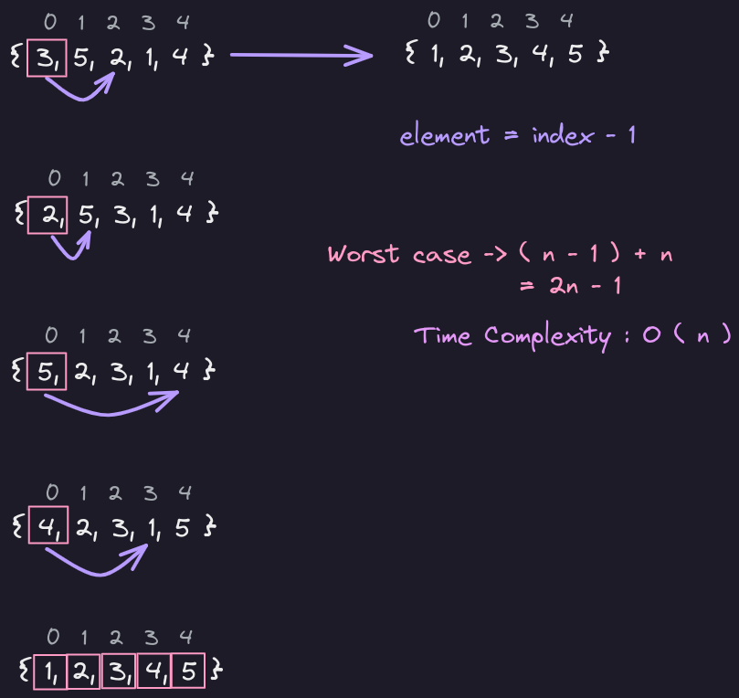

# Bubble Sort

Bubble Sort is also called Sinking or Exchange Sort.

In every step, adjacent elements are compared and swapped.



-   Space Complexity = $O(1)$ [In-place Sorting Algorithm]
    
-   Time Complexity :
    
    -   Best Case : $ O(n) $
    -   Worst Case : $O(n^2)$
    
-   In-place Sorting:
    -   A Sorting Algorithm which uses constant Space Complexity i.e. zero Auxiliary Space
-   Stable Sorting:
    -   A Sorting Algorithm without changing indexes of equal elements while sorting.


- 
  ```java
	package com.inclass;
	
	import java.util.Arrays;
	
	public class BubbleSort {
		
		public static void main(String[] args) {
			int[] arr = {5, 4, 3, 2, 1};
			bubbleSort(arr);
			System.out.println(Arrays.toString(arr));
		}
		
		static void bubbleSort(int[] arr) {
			int count = arr.length - 1;
			int check = 0;
			while (count > 0) {
				boolean sorted = false;
				for (int i = 0; i < count; i++) {
					check++;
					if (arr[i] > arr[i + 1]) {
						int temp = arr[i];
						arr[i] = arr[i + 1];
						arr[i + 1] = temp;
						sorted = true;
					}
				}
				if (!sorted) {
					break;
				}
				count--;
			}
			System.out.println(check);
		}
	}
```


# Selection Sort

-   In-place Sorting:
    -   A Sorting Algorithm which uses constant Space Complexity i.e. zero Auxiliary Space
-   Stable Sorting:
    -   A Sorting Algorithm without changing indexes of equal elements while sorting.

In Selection Sort, Largest or Smallest element is selected and is placed in correct place.



-   Time Complexity :
    -   Best Case : $O(n^2)$
    -   Worst Case : $O(n^2)$
-   Space Complexity : $O(1)$ [In-place Sorting]
-   Non-Stable Sorting Algorithm
-   Use Case : Performs well in small arrays

```java
package com.inclass;

import java.util.Arrays;

public class SelectionSortAlgorithm {
    public static void main(String[] args) {
        int[] arr = {4, 5, 1, 2, 3};
//        maxSelectionSort(arr);
        minSelectionSort(arr);
    }

    static void maxSelectionSort(int[] arr) {
        int count = arr.length - 1;
        while (count > 0) {
            int maxIndex = 0;
            for (int i = 1; i <= count; i++) {
                if (arr[i] > arr[maxIndex]) {
                    maxIndex = i;
                }
            }
            if (count != maxIndex) {
                int temp = arr[count];
                arr[count] = arr[maxIndex];
                arr[maxIndex] = temp;
            }
            System.out.println(Arrays.toString(arr));
            count--;
        }
    }

    static void minSelectionSort(int[] arr) {
        int count = 0;
        while (count < arr.length - 1) {
            int minIndex = count;
            for (int i = count + 1; i < arr.length; i++) {
                if (arr[i] < arr[minIndex]) {
                    minIndex = i;
                }
            }
            if (count != minIndex) {
                int temp = arr[count];
                arr[count] = arr[minIndex];
                arr[minIndex] = temp;
            }
            System.out.println(Arrays.toString(arr));
            count++;
        }
    }
}
```

# Insertion Sort
Insertion Sort is sorting the array in parts.



-   Space Complexity : $O(1)$ [In-place Sorting Algorithm]
-   Time Complexity :
    -   Best Case : $O(n)$
    -   Worst Case : $O(n^2)$
-   Stable Sorting Algorithm
-   Use Case : When array is partially sorted.

```java
package com.inclass;

import java.util.Arrays;

public class InsertionSort {
    public static void main(String[] args) {
        int[] arr = {5, 4, 3, 2, 1};
        insertionSort(arr);
        System.out.println(Arrays.toString(arr));
    }

    static void insertionSort(int[] arr) {
        for (int i = 0; i < arr.length - 1; i++) {
            System.out.println(Arrays.toString(arr));
            for (int j = i + 1; j > 0; j--) {
                if (arr[j] < arr[j - 1]) {
                    int temp = arr[j];
                    arr[j] = arr[j - 1];
                    arr[j - 1] = temp;
                } else {
                    break;
                }
            }
        }
    }
}

```

# Cyclic Sort
Cycle Sort is only applicable for arrays containing a range of elements.



-   Space Complexity : $O(1)$
-   Time Complexity :
    -   Best Case : $O(n)$
    -   Worst Case : $O(n)$

-  
  ```java
  package com.inclass;
    
    import java.util.Arrays;
    
    public class CycleSortAlgorithm {
        public static void main(String[] args) {
            int[] arr = {3, 5, 2, 1, 4};
            cycleSort(arr);
            System.out.println(Arrays.toString(arr));
        }
    
        static void cycleSort(int[] arr) {
            int index = 0;
            while(index < arr.length) {
                if (arr[index] != arr[arr[index] - 1]) {
                    System.out.println(Arrays.toString(arr));
                    int temp = arr[index];
                    arr[index] = arr[arr[index] - 1];
                    arr[temp - 1] = temp;
                } else {
                    index++;
                }
            }
        }
    }
  ```


# Merge Sort Algorithm  
  
Steps:  
  
1. Divide Array into 2 parts  
2. Sort both parts via Recursion  
3. Merge the sorted parts  


- Dividing Arrays:  
  1. {5, 3, 2, 1, 4}  
  2. {5, 3} + {2, 1, 4}  
  3. {5} + {3} + {2} + {1, 4}  
  4. {5} + {3} + {2} + {1} + {4}  


- Merging Arrays:  
  1. {5} + {3} + {2} + {1} + {4}  
  2. {5} + {3} + {2} + {1, 4}  
  3. {3, 5} + {1, 2, 4}  
  4. {1, 2, 3, 4, 5}  
  
## Not-In-Place Merge Sort  
  
```java  
package com.inclass;

import java.util.Arrays;

public class MergeSort {
    public static void main(String[] args) {
        int[] arr = {7, 9 ,1, 3, 5, 2, 4};
        System.out.println(Arrays.toString(mergeSort(arr)));
    }

    static int[] mergeSort (int[] arr) {
        if (arr.length == 1) {
            return arr;
        }

        int mid = arr.length / 2;

        int[] left = mergeSort(Arrays.copyOfRange(arr, 0, mid));
        int[] right = mergeSort(Arrays.copyOfRange(arr, mid, arr.length));

        return merge(left, right);
    }

    static int[] merge (int[] left, int[] right) {
        int[] mix = new int[left.length + right.length];

        int i = 0;
        int j = 0;

        while (i < left.length && j < right.length) {
            if (left[i] < right[j]) {
                mix[i + j] = left[i];
                i++;
            } else {
                mix[i + j] = right[j];
                j++;
            }
        }

        // it may be possible that one of the arrays is not complete
        // copy the remaining elements
        while (i < left.length) {
            mix[i + j] = left[i];
            i++;
        }

        while (j < right.length) {
            mix[i + j] = right[j];
            j++;
        }

        return mix;
    }
}
```  
  
### Time Complexity Analysis:  
  
Total Number of Levels = ${N}/ {2^k}$  
  
$\Rightarrow 1 = N/ 2^k \\ \Rightarrow2^k = N \\ \Rightarrow k = log_2N$  
  
$$  
\therefore O[N * log_2N]  
$$  
  
Space Complexity: O(N)  
  
**Recurrence Relation:**  
  
$$  
T[n] = T[\frac{n}{2}] + T[\frac{n}{2}] + [n - 1] \\ =  2T[\frac{n}{2}] + [n - 1]  
$$  
  
### Using Akra-Bazzi to find complexity:  
  
Finding $p,$  
  
$$  
a_1b_1^p = 1 \ \Rightarrow 2 * \frac{1}{2} = 1 \\  
\therefore p = 1  
$$  
  
$$  
T(x) = \theta (x^P + x^p \int_1^x \frac{g(u)du)}{u^{p+1}} \\   
= \theta(x + x \int_1^x \frac{(u-1)du}{u^2} \\  
= \theta(x + x\int^x_1 \frac{1}{u} du - x\int^x_1 \frac{1}{u^2}du \\  
= \theta(x+xlog(x)-x+1) \\  
= \theta(xlog(x))  
$$  
  
## In-Place Merge Sort  
  
```java  
package com.inclass;

import java.util.Arrays;

public class InplaceMergeSort {
    public static void main(String[] args) {
        int[] arr = {5, 4, 1, 2, 3};
        mergeSort(arr, 0 , arr.length - 1);
        System.out.println(Arrays.toString(arr));
    }

    static void mergeSort (int[] arr, int start, int end) {
        if (start >= end) {
            return;
        }
        int mid = start + (end - start + 1) / 2;
        mergeSort(arr, start, mid - 1);
        mergeSort(arr, mid, end);
        merge(arr, start, end);
    }

    static void merge (int[] arr, int start, int end) {
        int mid = start + (end - start + 1) / 2;
        while (start < mid && mid <= end) {
            if (arr[start] > arr[mid]) {
                for (int i = mid - 1; i >= start; i--) {
                    int temp = arr[i + 1];
                    arr[i + 1] = arr[i];
                    arr[i] = temp;
                }
                start++;
                mid++;
            } else {
                start++;
            }
        }
    }
}
```

# Quick Sort Algorithm  
  
- Pivot: Any Reference Variable  
- After first pass:  
  - all the elements < pivot will be on left side  
  - all the elements > pivot will be on right side  
  
## Last Pivot Sort  
  
Steps:  
  
1. (5, 3, 2, 1, 6)  
2. (5, 3, 2, 1) + (6)  
3. (1, 2, 3, 5) + (6)  
4. (1, 2, 3) + (5) + (6)  
5. (1, 2) + (3) + (5) + (6)  
6. (1) + (2) + (3) + (5) + (6)  
7. (1, 2, 3, 5, 6)  
  
```java  
package com.inclass;

import java.util.Arrays;

public class QuickSort {

    public static void main(String[] args) {
        int[] arr = new int[] {5, 3, 2, 1, 6};
        endPivot(arr, 0, arr.length - 1);
        System.out.println(Arrays.toString(arr));
    }

    static void endPivot (int[] arr, int start, int end) {
        if (start >= end) {
            return;
        }
        int startTemp = start;
        int pivot = end;
        while (start < pivot) {
            if (arr[start] > arr[pivot]) {
                int temp = arr[start];
                for (int i = start; i < pivot; i++) {
                    arr[i] = arr[i + 1];
                }
                arr[pivot--] = temp;
            } else {
                start++;
            }
        }
        print(arr, startTemp, end);
        endPivot(arr, startTemp, pivot - 1);
        endPivot(arr, pivot, end);
    }

    static void print (int[] arr, int start, int end) {
        System.out.print("[");
        for (int i = start; i < end; i++) {
            System.out.print(arr[i] + ", ");
        }
        System.out.println(arr[end] + "]");
    }
}
```  
  
## First Pivot Sort  
  
Steps:  
  
1. (5, 3, 2, 1, 6)  
2. (1, 2, 3, 5) + (6)  
3. (1) + (2, 3, 5) + (6)  
4. (1) + (2) + (3, 5) + (6)  
5. (1) + (2) + (3) + (5) + (6)  
6. (1, 2, 3, 5, 6)  
  
```java  
package com.inclass;

import java.util.Arrays;

public class QuickSort {

    public static void main(String[] args) {
        int[] arr = new int[] {5, 3, 2, 1, 6};
        startPivot(arr, 0, arr.length - 1);
        System.out.println(Arrays.toString(arr));
    }

    static void startPivot (int[] arr ,int start, int end) {
        if (start >= end) {
            return;
        }
        int endTemp = end;
        int pivot = start;
        while (end > pivot) {
            if (arr[end] < arr[pivot]) {
                int temp = arr[end];
                for (int i = end - 1; i >= pivot; i--) {
                    arr[i + 1] = arr[i];
                }
                arr[pivot++] = temp;
            } else {
                end--;
            }
        }
        print(arr, start, endTemp);
        startPivot(arr, start, pivot);
        startPivot(arr, pivot + 1, endTemp);
    }

    static void print (int[] arr, int start, int end) {
        System.out.print("[");
        for (int i = start; i < end; i++) {
            System.out.print(arr[i] + ", ");
        }
        System.out.println(arr[end] + "]");
    }
}
```  
  
## Middle Pivot Sort  
  
Steps:  
  
1. (2, 3, 5, 1, 6)  
2. (1) + (2, 3, 5, 6)  
3. (1) + (2, 3) + (5, 6)  
4. (1) + (2) + (3) + (5) + (6)  
5. (1, 2, 3, 5, 6)  
  
```java  
package com.inclass;

import java.util.Arrays;

public class QuickSort {

    public static void main(String[] args) {
        int[] arr = new int[] {5, 3, 2, 1, 6};
        midPivot(arr, 0, arr.length - 1);
        System.out.println(Arrays.toString(arr));
    }

    static void midPivot (int[] arr, int start, int end) {
        if (start >= end) {
            return;
        }
        int startTemp = start;
        int endTemp = end;
        int pivot = start + (end - start + 1) / 2;
        while (start < pivot) {
            if (arr[start] > arr[pivot]) {
                int temp = arr[start];
                for (int i = start; i < pivot; i++) {
                    arr[i] = arr[i + 1];
                }
                arr[pivot--] = temp;
            } else {
                start++;
            }
        }
        while (end > pivot) {
            if (arr[end] < arr[pivot]) {
                int temp = arr[end];
                for (int i = end - 1; i >= pivot; i--) {
                    arr[i + 1] = arr[i];
                }
                arr[pivot++] = temp;
            } else {
                end--;
            }
        }
        print(arr, startTemp, endTemp);
        midPivot(arr, startTemp, pivot - 1);
        midPivot(arr, pivot, endTemp);
    }

    static void print (int[] arr, int start, int end) {
        System.out.print("[");
        for (int i = start; i < end; i++) {
            System.out.print(arr[i] + ", ");
        }
        System.out.println(arr[end] + "]");
    }
}
```  
  
## Recurrence Relation:  
  
$$  
T[n] = T[k] + T[n-k-1] + O(n)  
$$  
  
- Worst Case (k = 0):  
      
    $$  
    ⁍  
    $$  
      
    when $n \rightarrow \infty, \ O(n)$ is less dominating,  
      
    $$  
    \Rightarrow f(n)=f(n-1) \\  
    \Rightarrow f(n)=(n-1) + f(n-2) \\  
    \Rightarrow f(n)=(n-1) + (n-2) + (n-3) + ... \\  
    \Rightarrow f(n)=\frac{n(n-1)}{2} \\ \Rightarrow f(n)= \frac{1}{2}(n^2-n)\\ \Rightarrow f(n)= O(n^2)  
    $$  
      
- Best Case (k= $\frac{n}{2}$):  
      
    $$  
    T[n] = T[\frac{n}{2}] + T[\frac{n}{2}] + [n - 1] \\ =  2T[\frac{n}{2}] + [n - 1]  
    $$  
      
    Using Akra-Bazzi to find complexity:  
      
    Finding $p,$  
      
    $$  
    a_1b_1^p = 1 \ \Rightarrow 2 * \frac{1}{2} = 1 \\  
    \therefore p = 1  
    $$  
      
    $$  
    T(x) = \theta (x^P + x^p \int_1^x \frac{g(u)du)}{u^{p+1}} \\  
    = \theta(x + x \int_1^x \frac{(u-1)du}{u^2} \\  
    = \theta(x + x\int^x_1 \frac{1}{u} du - x\int^x_1 \frac{1}{u^2}du \\  
    = \theta(x+xlog(x)-x+1) \\  
    = \theta(xlog(x))  
    $$