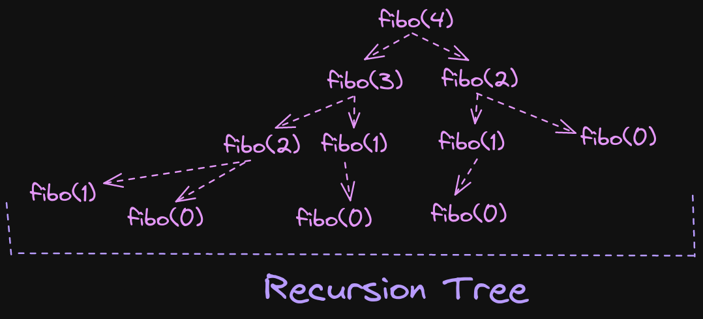
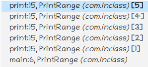
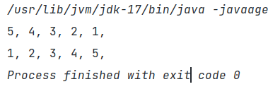

# Recursion

### Rules :

1. When the function has finished executing, the function is removed from the stack memory.
2. Until the function is executing, the function remain in the stack memory.

### Definition :

Recursion is Function calling itself.

### Conditions :

1. A base condition is required for stopping the calling another function under a function.
2. If no base condition is added then stack will be filled up and lead to “ Stack Overflow “.

### Why Recursion?

1. it helps us in solving bigger complex problems in simpler way.
2. In recursion, space complexity is not constant, because of recursive calls.
3. While problem-solving, first use recursion and then convert to iteration.

### How functions are called?

In stack memory :


---

## Types of Recurrence Relation :

1. Linear ( like Fibonacci )
2. Divide and Rule ( Space reduced by a factor ) ( like Binary Search )


## Level 1

##### Steps to understand a problem : 

1. Identify if you can breakdown the problem into smaller problems.
2. Write the recurrence relation if needed.
3. Draw the recursive tree
4. About the tree : 
  1. See the flow of the functions and how are they getting in the stack.
  2. Identify and focus on the left tree calls and the right tree calls.
  3. Draw the tree and pointer again and again using pen and paper.
  4. Use the Debugger to see the flow.
5. See how the values are returned at each step. See where the functions call will come out.


##### Q1. Fibonacci Numbers
    
Output : 0 1 1 2 3 5 8 13 21

1. Break the problem into smaller problems.
2. Base Condition is represented like fibo(0) = 0; fibo(1) = 1.



Recurence Relation : 

fibo(n) = fibo(n-1) + fibo(n-2).

Order of Function call :


```java
package com.inclass.basics;

import java.util.Scanner;

public class Fibonacci {
    public static void main(String[] args) {
        int n = 5;
        System.out.println(fibonacci(n));
        System.out.println(ultfibo(n, 0, 1));
    }

    static int fibonacci(int n) {
        if (n < 2) {
            return n;
        }
        return fibonacci(n - 1) + fibonacci(n - 2);
    }


    /*
    Runtime: 0 ms, faster than 100.00% of Java online submissions for Fibonacci Number.
    Memory Usage: 38.9 MB, less than 49.59% of Java online submissions for Fibonacci Number.
     */
    static int ultfibo (int n, int a, int b) {
        if (n == 0) {
            return a;
        }
        return ultfibo(n - 1, b, a + b);
    }
}

```
    

##### Q2. Binary Search [using Recursion]
    
```java
package com.inclass;

public class BinarySearch {
  public static void main(String[] args) {
	int[] arr = new int[] {1, 2, 3, 4, 5};
	System.out.println(binary(arr, 0, arr.length - 1, 4));
  }

  static int binary(int[] arr, int start, int end, int target) {
	if (start < end) {
	    int mid = start + (end - start) / 2;
	    if (arr[mid] > target) {
		  return binary(arr, start, mid - 1, target);
	    } else if (arr[mid] < target) {
		  return binary(arr, mid + 1, end, target);
	    }
	    return mid;
	}
	return -1;
  }
}
```
    

##### Q3. Printing Range




```java
package com.inclass;

public class PrintRange {
  public static void main(String[] args) {
	int n = 5;
	print(n);
	System.out.println();
	reversePrint(n);
  }
  static void print (int n) {
	if (n == 0) {
	    return;
	}
	System.out.print(n + ", ");
	print(n - 1);
  }

  static void reversePrint (int n) {
	if (n == 0) {
	    return;
	}
	reversePrint(n - 1);
	System.out.print(n + ", ");
  }
}
```



    


##### Q4. Factorial

```java
static int factorial (int n) {
	if (n < 2) {
		return 1;
	}
	return n * factorial(n - 1);
}

/* Output : 120  120
```
    

##### Q5. Sum of Digits
    
```java
static int sumofDigits(int n) {  
	if (n == 0)  
		return 0;  
	return n % 10 + sumofDigits(n / 10);  
} 
```
    


##### Q6. Reverse Integer
    
```java
// reverse(0, n)
static int reverse (int r, int n) {  
    if (n == 0) {  
        return r / 10;  
    }  
    return reverse((r + n % 10) * 10, n / 10);  
}

static int reverse (int n) {  
    if (n == 0) {  
        return 0;  
    }  
    if ((int) Math.log10(Math.abs(n)) == 0) {  
        return n;  
    }  
    return (int) (((n % 10) * Math.pow(10, (int) Math.log10(Math.abs(n)))) + reverse(n / 10));  
}
```
    

##### Q7. Palindrome Number
    
```java
static boolean palindrome (int n) {
	if (n / 10 == 0) {
		return true;
	}
	if (n / (int) Math.pow(10, (int) Math.log10(n)) == n % 10) {
		return palindrome((n % (int) Math.pow(10, (int) Math.log10(n)) - (n % 10)) / 10);
	}
	return false;
}

/* Output : true
```


##### Q8. Count number of zeros in Integer
    
```java
static int zero (int n) {  
    if (n == 0) {  
        return 0;  
    }  
    if (n % 10 != 0) {  
        return zero(n / 10);  
    }  
    return 1 + zero(n / 10);  
}
```
    

##### Q9. Count the number of steps to reduce a number to zero
    
```java
static int numberOfSteps(int n) {
	if (n == 0) 
		return 0;
	if (n % 2 == 1)
		return 1 + numberOfSteps(n - 1);
	return 1 + numberOfSteps(n/2);
}
```
    


## Arrays

##### Q1. Check Sorted Array    
```java
// betterSorted(arr, 0)
static boolean betterSorted (int[] arr, int index) {  
    if (index >= arr.length - 1) {  
        return true;  
    }  
    return arr[index] < arr[index + 1] && betterSorted(arr, index + 1);  
}
```

##### Q2. Linear Search
    
```java
static boolean linearSearch(int[] arr, int target, int count) {  
    if (count >= arr.length) {  
        return false;  
    }  
    return target == arr[count] || linearSearch(arr, target, count + 1);  
}  
```

```java
static ArrayList<Integer> list = new ArrayList<>(0);  
  
static ArrayList<Integer> multipleOccurrences (int[] arr, int target, int count) {  
    if (count >= arr.length) {  
        return list;  
    }  
    if (arr[count] == target) {  
        list.add(count);  
    }  
    return multipleOccurrences(arr, target, count + 1);  
}  
```

```java  
static ArrayList<Integer> returnArrayList (int[] arr, int target, int count) {  
    ArrayList<Integer> list = new ArrayList<>(1);  
    if (arr[count] == target) {  
        list.add(count);  
    }  
    if (count == arr.length - 1) {  
        return list;  
    }  
    list.addAll(returnArrayList(arr, target, count + 1));  
    return list;  
}
```
    


##### Returning Lists

Conditions:

1. Array-List cannot be taken in the parameter
2. return the list
- If we declare an Array-List in a recursive function
    - Problem:
        1. every time the function is called declaration of new Array-List will take place.
        2. every time the value is added to the list, it will remain for only one function call and the further function calls will not have the added value in the list.
            
            
            

##### Q3. Rotated Binary Search
    
```java
package com.inclass.arrays;

public class RotatedBinarySearch {
  public static void main(String[] args) {
	int[] arr = {4, 5, 6, 7, 1, 2, 3, 4};
	int target = 6;
	System.out.println(rotatedBinary(arr, target, 0, arr.length));
  }

  static int rotatedBinary (int[] arr, int target, int start, int end) {
	if (start > end) {
	    return -1;
	}
	int mid = start + (end - start) / 2;
	if (arr[mid] == target) {
	    return target;
	} else if (arr[mid] > arr[start]) {
	    if (arr[mid] < target) {
		  return rotatedBinary(arr, target, mid + 1, end);
	    }
	    return rotatedBinary(arr, target, start, mid - 1);
	} else {
	    if (arr[mid] < target) {
		  return rotatedBinary(arr, target, start, mid - 1);
	    }
	    return rotatedBinary(arr, target, mid + 1, end);
	}
  }
}
```
    


## Pattern

##### Pattern 1
```
* * * * *
* * * *
* * *
* *
*
```

```java
package com.inclass.pattern;

public class Pattern1 {
  public static void main(String[] args) {
	int n = 5;
	printPattern(n, n);
  }

  static void printPattern (int row, int col) {
	if (col > 0) {
	    System.out.print("* ");
	    printPattern(row, col - 1);
	} else if (row == 1) {
	    return;
	} else {
	    System.out.println();
	    printPattern(row - 1, row - 1);
	}
  }
}
```


##### Pattern 2

```
*
* *
* * *
* * * * 
* * * * *
```
    
```java
package com.inclass.pattern;

public class Pattern2 {
  public static void main(String[] args) {
	int n = 5;
	printPattern(n, n);
  }

  static void printPattern (int row, int col) {
	if (col > 0) {
	    printPattern(row, col - 1);
	    System.out.print("* ");
	} else if (row == 1) {
	    return;
	} else {
	    printPattern(row - 1, row - 1);
	    System.out.println();
	}
  }
}
```


## Sorting 

##### Bubble Sort
	    
```java
package com.inclass.sort;

import java.util.Arrays;

public class BubbleSort {
  public static void main (String[] args) {
	int[] arr = {5, 4, 3, 2, 1};
	System.out.println(Arrays.toString(bubble(arr, arr.length - 1, 0)));
  }

  static int[] bubble (int[] arr, int i, int j) {
	if (j < i) {
	    if (arr[j] > arr[j + 1]) {
		  int temp = arr[j + 1];
		  arr[j + 1] = arr[j];
		  arr[j] = temp;
		  return bubble(arr, i, j + 1);
	    }
	} else if (i == 1) {
	    return arr;
	}
	return bubble(arr, i - 1, 0);
  }
}
```


##### Selection Sort
	    
```java
package com.inclass.sort;

import java.util.Arrays;

public class SelectionSort {
  public static void main(String[] args) {
	int[] arr = {4, 5, 2, 1, 3};
	System.out.println(Arrays.toString(selection(arr, arr.length - 1, arr.length - 1, arr.length - 2)));
  }

  static int[] selection (int[] arr, int i, int max, int maxCount) {
	if (maxCount >= 0) {
	    if (arr[max] < arr[maxCount]) {
		  return selection(arr, i, maxCount, maxCount - 1);
	    }
	    return selection(arr, i, max, maxCount - 1);
	} else if (i >= 1)  {
	    int temp = arr[i];
	    arr[i] = arr[max];
	    arr[max] = temp;
	    return selection(arr, i - 1, i - 1, i - 2);
	}
	return arr;
  }
}
```
    


## Strings

##### Q1. Remove character from string
    
```java
package com.inclass.strings;

public class RemoveChar {
  public static void main(String[] args) {
	String word = "Linkin";
	char remove = 'i';
	removeChar(word, remove);
	System.out.println();
	System.out.println(removeChar2(word, remove));
  }

  static void removeChar (String word, char remove) {
	if (word.isEmpty()) {
	    return;
	}
	removeChar(word.substring(0 , word.length() - 1), remove);
	if (word.charAt(word.length() - 1) != remove) {
	    System.out.print(word.charAt(word.length() - 1));
	}
  }

  static String removeChar2 (String word, char remove) {
	if (word.isEmpty()) {
	    return "";
	}
	if (word.charAt(word.length() - 1) == remove) {
	    return removeChar2(word.substring(0, word.length() - 1), remove);
	}
	char ch = word.charAt(word.length() - 1);
	return removeChar2(word.substring(0, word.length() - 1), remove) + ch;
  }
}
```
    

##### Q2. Skip String from string
    
```java
package com.inclass.strings;

public class SkipString {
  public static void main(String[] args) {
	String str = "Martini";
	String target = "tin";
	System.out.println(skipString(str, target));
  }

  static String skipString (String str, String target) {
	if (str.length() < target.length()) {
	    return str;
	}
	else if (str.startsWith(target)) {
	    return skipString(str.substring(target.length()), target);
	}
	return str.charAt(0) + skipString(str.substring(1), target);
  }
}
```
    

##### Q3. Subsets of characters
- For Example: str = “abc”, 
$$ \therefore str \subset [a], [b], [c], [a,b], [a,c], [b,c], [abc]$$
- Note: Subset pattern is taking & removing some elements

###### Steps:

$$1. [:abc] $$
$$2. [a:bc] + [:bc] $$
$$3. [ab:c] + [a:c] + [b:c] + [:c]$$
$$4. [abc:] + [ab:] + [ac:] + [a:] + [bc:] + [b:] + [c:] + [:]$$
  
######  Complexity Analysis:
  
  n → number of elements / levels
  
  $2^n$ → number of sub-arrays
  
  $$O(n*2^n)$$
  
######  Code using Recursion:
  
  ```java
  package com.inclass.strings;
  
  public class Subset {
	public static void main(String[] args) {
	    String str = "123";
	    System.out.println(subset("", str));
	}
  
	static String subset (String sub, String str) {
	    if (str.length() == 0) {
		  return sub + " ";
	    }
	    return subset(sub + str.substring(0, 1), str.substring(1)) + subset(sub, str.substring(1));
	}
  }
  ```
  
  Output: ```123, 12, 13, 1, 23, 2, 3, ,```
  
######  Code using Iteration:
  
  ```java
  package com.inclass.strings;
  
  import java.util.List;
  import java.util.ArrayList;
  
  public class Subsequence {
	public static void main(String[] args) {
	    int[] arr = {1, 2, 3};
	    System.out.println(subset(arr));
	}
  
	static List<List<Integer>> subset(int[] arr) {
	    List<List<Integer>> outer = new ArrayList<>();
	    outer.add(new ArrayList<>());
	    for (int num : arr) {
		  for (int i = 0; i < outer.size(); i++) {
			List<Integer> internal = new ArrayList<>(outer.get(i));
			internal.add(num);
			outer.add(internal);
		  }
	    }
	    return outer;
	}
  }
  ```
  
  Output: ```[[], [1], [2], [1, 2], [3], [1, 3], [2, 3], [1, 2, 3]]```
  
###### Code for duplicate elements by Iteration:
  
  ```java
  package com.inclass.strings;
  
  import java.util.List;
  import java.util.ArrayList;
  
  public class Subsequence {
	public static void main(String[] args) {
	    int[] arr = {1, 2, 2};
	    System.out.println(subsetDuplicates(arr));
	}
  
	static List<List<Integer>> subsetDuplicates(int[] arr) {
	    List<List<Integer>> outer = new ArrayList<>();
	    outer.add(new ArrayList<>());
	    for (int num : arr) {
		  int n = outer.size();
		  int i = n / 2;
		  if (outer.get(n - 1).size() == 0 || outer.get(n - 1).get(outer.get(n - 1).size() - 1) != num) {
			i = 0;
		  }
		  while(i < n) {
			List<Integer> internal = new ArrayList<>(outer.get(i));
			internal.add(num);
			outer.add(internal);
			i++;
		  }
	    }
	    return outer;
	}
  }
  ```
  
  Output: `[[], [1], [2], [1, 2], [2, 2], [1, 2, 2]]`
  

##### Q4. Permutation of characters

###### Steps:
  
  $$1. \ :abc $$
  $$2. \ a:bc $$
  $$3.\ ba, ab:c $$
  $$4. \ cba, bca, bac, cab, acb, abc: $$
  
######  Permutation using Strings
  
  ```java
  package com.inclass.strings;
  
  import java.util.ArrayList;
  import java.util.List;
  
  public class Permutation {
	public static void main(String[] args) {
	    String str = "abc";
	    permutation("", str);
	}
  
	static void permutation (String one, String two) {
	    if (two.length() == 0) {
		  System.out.print(one + ", ");
		  return;
	    }
	    for (int i = 0; i <= one.length(); i++) {
		  permutation(one.substring(0, i) + two.charAt(0) + one.substring(i), two.substring(1));
	    }
	}
  }
  ```
  
  Output: `cba, bca, bac, cab, acb, abc,`
  
######  Permutation using Array-Lists
  
  ```java
  package com.inclass.strings;
  
  import java.util.ArrayList;
  import java.util.List;
  
  public class Permutation {
	public static void main(String[] args) {
	    String str = "abc";
	    System.out.println(permu("", str));
	}
  
	static List<String> permu (String one, String two) {
	    List<String> strarr = new ArrayList<>();
	    if (two.length() == 0) {
		  strarr.add(one);
		  return strarr;
	    }
	    for (int i = 0; i <= one.length(); i++) {
		  strarr.addAll(permu(one.substring(0, i) + two.charAt(0) + one.substring(i), two.substring(1)));
	    }
	    return strarr;
	}
  }
  ```
  
  Output: `[cba, bca, bac, cab, acb, abc]`
  
######  Permutation using Iteration
  
  ```java
  package com.inclass.strings;
  
  import java.util.ArrayList;
  import java.util.List;
  
  public class Permutation {
	public static void main(String[] args) {
	    String str = "abc";
	    System.out.println(norecusion(str));
	}
  
	static List<String> norecusion (String two) {
	    List<String> list = new ArrayList<>();
	    list.add("");
	    while (two.length() > 0) {
		  int j = list.size() - 1;
		  while (j >= 0) {
  //                System.out.println(list);
			for (int k = 0; k <= list.get(j).length(); k++) {
			    list.add(list.get(j).substring(0, k) + two.charAt(0) + list.get(j).substring(k));
  //                    System.out.println("->" + list);
			}
  //                System.out.println(list);
			list.remove(j);
			j--;
		  }
		  two = two.substring(1);
	    }
	    return list;
	}
  }
  ```
  
  Output: `[cab, acb, abc, cba, bca, bac]`
  
######  Count number of Permutations:
	  
  ```java
  package com.inclass.strings;
  
  import java.util.ArrayList;
  import java.util.List;
  
  public class Permutation {
	public static void main(String[] args) {
	    String str = "abc";
	    System.out.println(countPermu(str.length()));
	}
  
	static int countPermu (int n) {
	    if (n < 2) {
		  return 1;
	    }
	    return n * countPermu(n - 1);
	}
  }
  ```
  
  Output: `6`