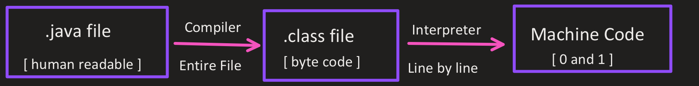
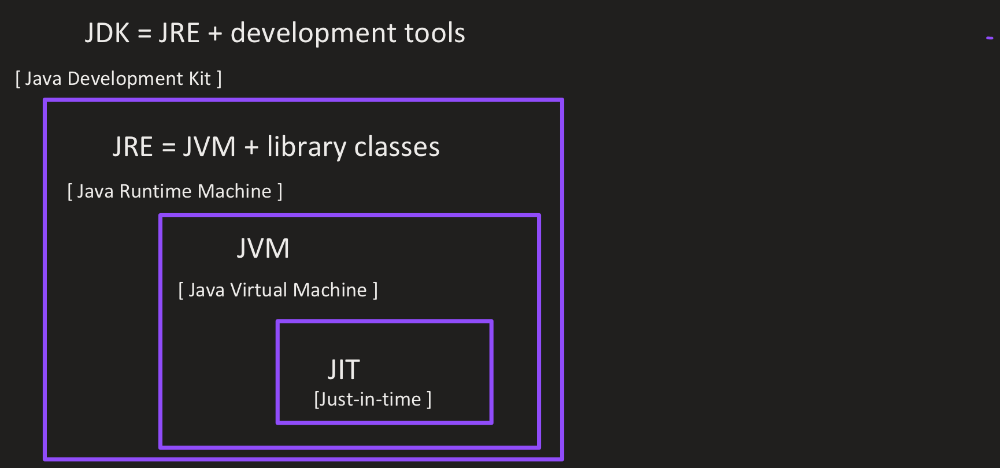
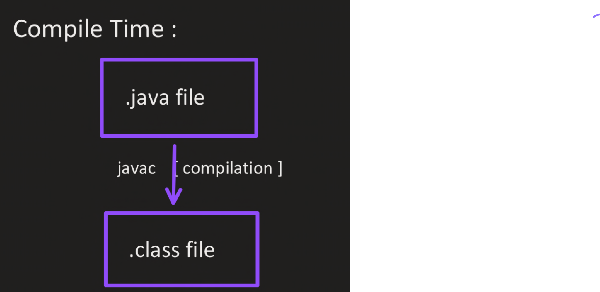

# Introduction to Java

1.  This code will not directly run on a system.
2.  Only JVM ( interpreter ) can run the byte code
3.  " Java is platform independent "

### Platform Independence

1.  In C & C++, the compiler converts source code to machine code [ which is executable ], which is .exe file, making it platform independent.
2.  In Java, the compiler converts source code its byte-code [ which will run on all platforms ]. [ Different operating systems have different Java Virtual Machine ] JVM converts the byte code into machine code.

## Java Architecture

### Java Development Kit [ JDK ] :

1.  Development tools -> provides an environment to develop
2.  JRE -> executes the program
3.  Compiler [ javac ]
4.  Archive [ jar ]
5.  Interpreter / loader

### Java Runtime Environment [ JRE ] :

1.  It only provides an environment to only to run the program.
2.  Class loader loads all classes (.class files) needed to execute the program.
3.  JVM send code to bytecode verifier to check the format of code.
4.  It consists of:
    1.  Development Technologies
    2.  User Interface Toolkits
    3.  Integration Libraries
    4.  Base Libraries
    5.  JVM

## How Java works ?

Class Loader :

1.  Loading :
    1.  Reads .class file and generates binary code
    2.  An object of class is created in heap
2.  Linking :
    1.  Searches for illegal practices in .class file.
    2.  Allocates memory for class variables and default variables.
    3.  Replace symbolic references from the type with direct references [ used in functions ]
3.  Initialization :
    1.  All static variables are assigned with their values defined in the code and static block.

JVM Execution :

1.  Interpreter :
    1.  Line by line execution
    2.  When one method is called many times, then the interpreter will execute many times
2.  JIT [ Just-in-Time ] :
    1.  It provides the direct machine code instead of re-interpretation of a method
    2.  Makes execution faster
3.  Garbage Collection :
    1.  Removes object without reference variable from the heap memory