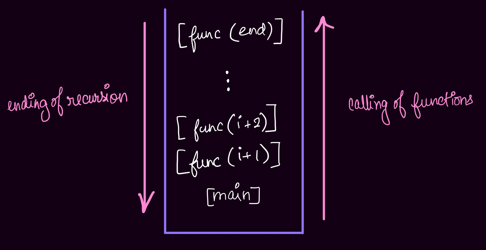

# Recursion

### Rules :

1. When the function has finished executing, the function is removed from the stack memory.
2. Until the function is executing, the function remain in the stack memory.

### Definition :

Recursion is Function calling itself.

### Conditions :

1. A base condition is required for stopping the calling another function under a function.
2. If no base condition is added then stack will be filled up and lead to “ Stack Overflow “.

### Why Recursion?

1. it helps us in solving bigger complex problems in simpler way.
2. In recursion, space complexity is not constant, because of recursive calls.
3. While problem-solving, first use recursion and then convert to iteration.

### How functions are called?

In stack memory :



---

## Types of Recurrence Relation :

1. Linear ( like Fibonacci )
2. Divide and Rule ( Space reduced by a factor ) ( like Binary Search )


## Level 1

##### Steps to understand a problem : 

1. Identify if you can breakdown the problem into smaller problems.
2. Write the recurrence relation if needed.
3. Draw the recursive tree
4. About the tree : 
  1. See the flow of the functions and how are they getting in the stack.
  2. Identify and focus on the left tree calls and the right tree calls.
  3. Draw the tree and pointer again and again using pen and paper.
  4. Use the Debugger to see the flow.
5. See how the values are returned at each step. See where the functions call will come out.


##### Q1. Fibonacci Numbers
    
Output : 0 1 1 2 3 5 8 13 21

1. Break the problem into smaller problems.
2. Base Condition is represented like fibo(0) = 0; fibo(1) = 1.


Recurence Relation : 

fibo(n) = fibo(n-1) + fibo(n-2).

Order of Function call :


```java
package com.inclass.basics;

import java.util.Scanner;

public class Fibonacci {
    public static void main(String[] args) {
        int n = 5;
        System.out.println(fibonacci(n));
        System.out.println(ultfibo(n, 0, 1));
    }

    static int fibonacci(int n) {
        if (n < 2) {
            return n;
        }
        return fibonacci(n - 1) + fibonacci(n - 2);
    }


    /*
    Runtime: 0 ms, faster than 100.00% of Java online submissions for Fibonacci Number.
    Memory Usage: 38.9 MB, less than 49.59% of Java online submissions for Fibonacci Number.
     */
    static int ultfibo (int n, int a, int b) {
        if (n == 0) {
            return a;
        }
        return ultfibo(n - 1, b, a + b);
    }
}

```
    

##### Q2. Binary Search [using Recursion]
    
```java
package com.inclass;

public class BinarySearch {
  public static void main(String[] args) {
	int[] arr = new int[] {1, 2, 3, 4, 5};
	System.out.println(binary(arr, 0, arr.length - 1, 4));
  }

  static int binary(int[] arr, int start, int end, int target) {
	if (start < end) {
	    int mid = start + (end - start) / 2;
	    if (arr[mid] > target) {
		  return binary(arr, start, mid - 1, target);
	    } else if (arr[mid] < target) {
		  return binary(arr, mid + 1, end, target);
	    }
	    return mid;
	}
	return -1;
  }
}
```
    

##### Q3. Printing Range


```java
package com.inclass;

public class PrintRange {
  public static void main(String[] args) {
	int n = 5;
	print(n);
	System.out.println();
	reversePrint(n);
  }
  static void print (int n) {
	if (n == 0) {
	    return;
	}
	System.out.print(n + ", ");
	print(n - 1);
  }

  static void reversePrint (int n) {
	if (n == 0) {
	    return;
	}
	reversePrint(n - 1);
	System.out.print(n + ", ");
  }
}
```


    

    


##### Q4. Factorial

```java
package com.inclass;

public class Factorial {
  public static void main(String[] args) {
	int n = 5;
	System.out.println(factorial(n));
	System.out.println(fact(n, 1));
  }

  static int fact(int n, int factorial) {
	if (n == 0) {
	    return factorial;
	}
	factorial *= n;
	return fact(n - 1, factorial);
  }

  static int factorial (int n) {
	if (n == 1) {
	    return 1;
	}
	return n * factorial(n - 1);
  }
}

/* Output : 120  120
```
    

##### Q5. Sum of Digits
    
    ```java
    
    ```
    


##### Q6. Reverse Integer
    
```java
package com.inclass;

public class ReverseInt {
  public static void main(String[] args) {
	int n = 12345;
	System.out.println(reverse(n));
  }

  static int reverse (int n) {
	if ((int) Math.log10(n) == 0) {
	    return n * 10000;
	}
	return ((n % 10) * 100000 + reverse(n / 10)) / 10;
  }
}
```
    

##### Q7. Palindrome Number
    
```java
package com.inclass;

public class Palindrome {
  public static void main(String[] args) {
	int n = 12321;
	System.out.println(palindrome(n));
  }

  static boolean palindrome (int n) {
	if (n / 10 == 0) {
	    return true;
	}
	if (n / (int) Math.pow(10, (int) Math.log10(n)) == n % 10) {
	    return palindrome((n % (int) Math.pow(10, (int) Math.log10(n)) - (n % 10)) / 10);
	}
	return false;
  }
}

/* Output : true
```


##### Q8. Count number of zeros in Integer
    
```java
package com.inclass;

public class CountZero {
  public static void main (String[] args) {
	int n = 10030;
	System.out.println(zero(n, 0));
  }

  static int zero (int n, int count) {
	if (n == 0) {
	    return count;
	}
	if (n % 10 == 0) {
	    count++;
	}
	return zero(n / 10, count);
  }
}
```
    

##### Q9. Count the number of steps to reduce a number to zero
    
```java
package com.inclass;

public class StepsToZero {
  public static void main(String[] args) {
	int n = 14;
	System.out.println(steps(n));
	System.out.println(stepsRec(n, 0));
  }
  
  /*
  Runtime: 0 ms, faster than 100.00% of Java online submissions for Number of Steps to Reduce a Number to Zero.
  Memory Usage: 39.2 MB, less than 18.26% of Java online submissions for Number of Steps to Reduce a Number to Zero.
   */
  static int stepsRec(int n, int count) {
	if (n == 0) {
	    return count;
	}
	if (n % 2 == 1) {
	    return stepsRec(n - 1, count + 1);
	}
	return stepsRec(n / 2, count + 1);
  }

  /*
  Runtime: 0 ms, faster than 100.00% of Java online submissions for Number of Steps to Reduce a Number to Zero.
  Memory Usage: 39 MB, less than 18.91% of Java online submissions for Number of Steps to Reduce a Number to Zero.
   */
  static int steps (int n) {
	int count = 0;
	while (n > 0) {
	    if (n % 2 == 1) {
		  n -= 1;
		  count++;
	    } else {
		  n /= 2;
		  count++;
	    }
	}
	return count;
  }
}
```
    


## Arrays

##### Q1. Check Sorted Array    
```java
package com.inclass;

public class CountZero {
    public static void main (String[] args) {
	  int n = 10030;
	  System.out.println(zero(n, 0));
    }

    static int zero (int n, int count) {
	  if (n == 0) {
		return count;
	  }
	  if (n % 10 == 0) {
		count++;
	  }
	  return zero(n / 10, count);
    }
}
```

##### Q2. Linear Search
    
```java
package com.arrays;

import java.util.ArrayList;

public class LinearSearch {
  public static void main(String[] args) {
	int[] arr = new int[] {1, 2, 3, 4, 4, 5};
	int target = 4;
	System.out.println(linearSearch(arr, target , 0));
	System.out.println(multipleOccurrences(arr, target, 0));
  }

  static boolean linearSearch(int[] arr, int target, int count) {
	if (count >= arr.length) {
	    return false;
	}
	return target == arr[count] || linearSearch(arr, target, count + 1);
  }

  static ArrayList<Integer> list = new ArrayList<>(0);

  static ArrayList<Integer> multipleOccurrences (int[] arr, int target, int count) {
	if (count >= arr.length) {
	    return list;
	}
	if (arr[count] == target) {
	    list.add(count);
	}
	return multipleOccurrences(arr, target, count + 1);
  }
}
```
    


##### Returning Lists

Conditions:

1. Array-List cannot be taken in the parameter
2. return the list
- If we declare an Array-List in a recursive function
    - Problem:
        1. every time the function is called declaration of new Array-List will take place.
        2. every time the value is added to the list, it will remain for only one function call and the further function calls will not have the added value in the list.
            
            
            

##### Q3. Rotated Binary Search
    
```java
package com.inclass.arrays;

public class RotatedBinarySearch {
  public static void main(String[] args) {
	int[] arr = {4, 5, 6, 7, 1, 2, 3, 4};
	int target = 6;
	System.out.println(rotatedBinary(arr, target, 0, arr.length));
  }

  static int rotatedBinary (int[] arr, int target, int start, int end) {
	if (start > end) {
	    return -1;
	}
	int mid = start + (end - start) / 2;
	if (arr[mid] == target) {
	    return target;
	} else if (arr[mid] > arr[start]) {
	    if (arr[mid] < target) {
		  return rotatedBinary(arr, target, mid + 1, end);
	    }
	    return rotatedBinary(arr, target, start, mid - 1);
	} else {
	    if (arr[mid] < target) {
		  return rotatedBinary(arr, target, start, mid - 1);
	    }
	    return rotatedBinary(arr, target, mid + 1, end);
	}
  }
}
```
    


## Pattern

##### Pattern 1
```
* * * * *
* * * *
* * *
* *
*
```

```java
package com.inclass.pattern;

public class Pattern1 {
  public static void main(String[] args) {
	int n = 5;
	printPattern(n, n);
  }

  static void printPattern (int row, int col) {
	if (col > 0) {
	    System.out.print("* ");
	    printPattern(row, col - 1);
	} else if (row == 1) {
	    return;
	} else {
	    System.out.println();
	    printPattern(row - 1, row - 1);
	}
  }
}
```


##### Pattern 2

```
*
* *
* * *
* * * * 
* * * * *
```
    
```java
package com.inclass.pattern;

public class Pattern2 {
  public static void main(String[] args) {
	int n = 5;
	printPattern(n, n);
  }

  static void printPattern (int row, int col) {
	if (col > 0) {
	    printPattern(row, col - 1);
	    System.out.print("* ");
	} else if (row == 1) {
	    return;
	} else {
	    printPattern(row - 1, row - 1);
	    System.out.println();
	}
  }
}
```


## Sorting 

##### Bubble Sort
	    
```java
package com.inclass.sort;

import java.util.Arrays;

public class BubbleSort {
  public static void main (String[] args) {
	int[] arr = {5, 4, 3, 2, 1};
	System.out.println(Arrays.toString(bubble(arr, arr.length - 1, 0)));
  }

  static int[] bubble (int[] arr, int i, int j) {
	if (j < i) {
	    if (arr[j] > arr[j + 1]) {
		  int temp = arr[j + 1];
		  arr[j + 1] = arr[j];
		  arr[j] = temp;
		  return bubble(arr, i, j + 1);
	    }
	} else if (i == 1) {
	    return arr;
	}
	return bubble(arr, i - 1, 0);
  }
}
```


##### Selection Sort
	    
```java
package com.inclass.sort;

import java.util.Arrays;

public class SelectionSort {
  public static void main(String[] args) {
	int[] arr = {4, 5, 2, 1, 3};
	System.out.println(Arrays.toString(selection(arr, arr.length - 1, arr.length - 1, arr.length - 2)));
  }

  static int[] selection (int[] arr, int i, int max, int maxCount) {
	if (maxCount >= 0) {
	    if (arr[max] < arr[maxCount]) {
		  return selection(arr, i, maxCount, maxCount - 1);
	    }
	    return selection(arr, i, max, maxCount - 1);
	} else if (i >= 1)  {
	    int temp = arr[i];
	    arr[i] = arr[max];
	    arr[max] = temp;
	    return selection(arr, i - 1, i - 1, i - 2);
	}
	return arr;
  }
}
```
    


## Strings

##### Q1. Remove character from string
    
```java
package com.inclass.strings;

public class RemoveChar {
  public static void main(String[] args) {
	String word = "Linkin";
	char remove = 'i';
	removeChar(word, remove);
	System.out.println();
	System.out.println(removeChar2(word, remove));
  }

  static void removeChar (String word, char remove) {
	if (word.isEmpty()) {
	    return;
	}
	removeChar(word.substring(0 , word.length() - 1), remove);
	if (word.charAt(word.length() - 1) != remove) {
	    System.out.print(word.charAt(word.length() - 1));
	}
  }

  static String removeChar2 (String word, char remove) {
	if (word.isEmpty()) {
	    return "";
	}
	if (word.charAt(word.length() - 1) == remove) {
	    return removeChar2(word.substring(0, word.length() - 1), remove);
	}
	char ch = word.charAt(word.length() - 1);
	return removeChar2(word.substring(0, word.length() - 1), remove) + ch;
  }
}
```
    

##### Q2. Skip String from string
    
```java
package com.inclass.strings;

public class SkipString {
  public static void main(String[] args) {
	String str = "Martini";
	String target = "tin";
	System.out.println(skipString(str, target));
  }

  static String skipString (String str, String target) {
	if (str.length() < target.length()) {
	    return str;
	}
	else if (str.startsWith(target)) {
	    return skipString(str.substring(target.length()), target);
	}
	return str.charAt(0) + skipString(str.substring(1), target);
  }
}
```
    

##### Q3. Subsets of characters
- For Example: str = “abc”, 
$$ \therefore str \subset [a], [b], [c], [a,b], [a,c], [b,c], [abc]$$
- Note: Subset pattern is taking & removing some elements

###### Steps:

$$1. [:abc] $$
$$2. [a:bc] + [:bc] $$
$$3. [ab:c] + [a:c] + [b:c] + [:c]$$
$$4. [abc:] + [ab:] + [ac:] + [a:] + [bc:] + [b:] + [c:] + [:]$$
  
######  Complexity Analysis:
  
  n → number of elements / levels
  
  $2^n$ → number of sub-arrays
  
  $$O(n*2^n)$$
  
######  Code using Recursion:
  
  ```java
  package com.inclass.strings;
  
  public class Subset {
	public static void main(String[] args) {
	    String str = "123";
	    System.out.println(subset("", str));
	}
  
	static String subset (String sub, String str) {
	    if (str.length() == 0) {
		  return sub + " ";
	    }
	    return subset(sub + str.substring(0, 1), str.substring(1)) + subset(sub, str.substring(1));
	}
  }
  ```
  
  Output: ```123, 12, 13, 1, 23, 2, 3, ,```
  
######  Code using Iteration:
  
  ```java
  package com.inclass.strings;
  
  import java.util.List;
  import java.util.ArrayList;
  
  public class Subsequence {
	public static void main(String[] args) {
	    int[] arr = {1, 2, 3};
	    System.out.println(subset(arr));
	}
  
	static List<List<Integer>> subset(int[] arr) {
	    List<List<Integer>> outer = new ArrayList<>();
	    outer.add(new ArrayList<>());
	    for (int num : arr) {
		  for (int i = 0; i < outer.size(); i++) {
			List<Integer> internal = new ArrayList<>(outer.get(i));
			internal.add(num);
			outer.add(internal);
		  }
	    }
	    return outer;
	}
  }
  ```
  
  Output: ```[[], [1], [2], [1, 2], [3], [1, 3], [2, 3], [1, 2, 3]]```
  
###### Code for duplicate elements by Iteration:
  
  ```java
  package com.inclass.strings;
  
  import java.util.List;
  import java.util.ArrayList;
  
  public class Subsequence {
	public static void main(String[] args) {
	    int[] arr = {1, 2, 2};
	    System.out.println(subsetDuplicates(arr));
	}
  
	static List<List<Integer>> subsetDuplicates(int[] arr) {
	    List<List<Integer>> outer = new ArrayList<>();
	    outer.add(new ArrayList<>());
	    for (int num : arr) {
		  int n = outer.size();
		  int i = n / 2;
		  if (outer.get(n - 1).size() == 0 || outer.get(n - 1).get(outer.get(n - 1).size() - 1) != num) {
			i = 0;
		  }
		  while(i < n) {
			List<Integer> internal = new ArrayList<>(outer.get(i));
			internal.add(num);
			outer.add(internal);
			i++;
		  }
	    }
	    return outer;
	}
  }
  ```
  
  Output: `[[], [1], [2], [1, 2], [2, 2], [1, 2, 2]]`
  

##### Q4. Permutation of characters

###### Steps:
  
  $$1. \ :abc $$
  $$2. \ a:bc $$
  $$3.\ ba, ab:c $$
  $$4. \ cba, bca, bac, cab, acb, abc: $$
  
######  Permutation using Strings
  
  ```java
  package com.inclass.strings;
  
  import java.util.ArrayList;
  import java.util.List;
  
  public class Permutation {
	public static void main(String[] args) {
	    String str = "abc";
	    permutation("", str);
	}
  
	static void permutation (String one, String two) {
	    if (two.length() == 0) {
		  System.out.print(one + ", ");
		  return;
	    }
	    for (int i = 0; i <= one.length(); i++) {
		  permutation(one.substring(0, i) + two.charAt(0) + one.substring(i), two.substring(1));
	    }
	}
  }
  ```
  
  Output: `cba, bca, bac, cab, acb, abc,`
  
######  Permutation using Array-Lists
  
  ```java
  package com.inclass.strings;
  
  import java.util.ArrayList;
  import java.util.List;
  
  public class Permutation {
	public static void main(String[] args) {
	    String str = "abc";
	    System.out.println(permu("", str));
	}
  
	static List<String> permu (String one, String two) {
	    List<String> strarr = new ArrayList<>();
	    if (two.length() == 0) {
		  strarr.add(one);
		  return strarr;
	    }
	    for (int i = 0; i <= one.length(); i++) {
		  strarr.addAll(permu(one.substring(0, i) + two.charAt(0) + one.substring(i), two.substring(1)));
	    }
	    return strarr;
	}
  }
  ```
  
  Output: `[cba, bca, bac, cab, acb, abc]`
  
######  Permutation using Iteration
  
  ```java
  package com.inclass.strings;
  
  import java.util.ArrayList;
  import java.util.List;
  
  public class Permutation {
	public static void main(String[] args) {
	    String str = "abc";
	    System.out.println(norecusion(str));
	}
  
	static List<String> norecusion (String two) {
	    List<String> list = new ArrayList<>();
	    list.add("");
	    while (two.length() > 0) {
		  int j = list.size() - 1;
		  while (j >= 0) {
  //                System.out.println(list);
			for (int k = 0; k <= list.get(j).length(); k++) {
			    list.add(list.get(j).substring(0, k) + two.charAt(0) + list.get(j).substring(k));
  //                    System.out.println("->" + list);
			}
  //                System.out.println(list);
			list.remove(j);
			j--;
		  }
		  two = two.substring(1);
	    }
	    return list;
	}
  }
  ```
  
  Output: `[cab, acb, abc, cba, bca, bac]`
  
######  Count number of Permutations:
	  
  ```java
  package com.inclass.strings;
  
  import java.util.ArrayList;
  import java.util.List;
  
  public class Permutation {
	public static void main(String[] args) {
	    String str = "abc";
	    System.out.println(countPermu(str.length()));
	}
  
	static int countPermu (int n) {
	    if (n < 2) {
		  return 1;
	    }
	    return n * countPermu(n - 1);
	}
  }
  ```
  
  Output: `6`


## Assignments🧠

### Easy 🤘🏻

- [Sum Triangle from Array](https://www.geeksforgeeks.org/sum-triangle-from-array/) `GFG`
    
    ```java
    package com.questions.easy;
    
    import java.util.Arrays;
    // https://www.geeksforgeeks.org/sum-triangle-from-array/
    public class SumTriangle {
        public static void main(String[] args) {
            int[] arr = new int[] {1, 2, 3, 4, 5};
            triangle(arr);
        }
    
        static void triangle(int[] arr) {
            if (arr.length == 1) {
                System.out.println(Arrays.toString(arr));
                return;
            }
            int[] temp = new int[arr.length - 1];
            for (int i = 0; i < arr.length - 1; i++) {
                temp[i] = arr[i] + arr[i + 1];
            }
            triangle(temp);
            System.out.println(Arrays.toString(arr));
        }
    }
    ```
    
- [Maximum and Minimum value in an array](https://www.geeksforgeeks.org/recursive-programs-to-find-minimum-and-maximum-elements-of-array/) `GFG`
    
    int[] arr = new int[] {5, 4, 3, 2}
    
    Steps: 
    
    1. f(4) = Math.min(2, f(3))
    2. f(3) = Math.min(3, f(2))
    3. f(2) = Math.min(4, f(1) = 5)
    
    ```java
    package com.questions.easy;
    
    public class MinMax {
        public static void main(String[] args) {
            int[] arr = new int[] {1, 4, 3, 5, -5, -4, 8, 6};
            System.out.println(min(arr, arr.length));
        }
    
        static int min(int[] arr, int count) {
            if (count ==  1) {
                return arr[0];
            }
            return Math.min(arr[count - 1], min(arr, count - 1));
        }
    }
    ```
    
- [Binary Search using recursion](https://leetcode.com/problems/binary-search/) `leetcode`
    
    ```java
    package com.questions.easy;
    
    import java.util.Arrays;
    
    public class BinarySearch {
        public static void main(String[] args) {
            int[] arr = new int[] {5, 6, 7, 8, 9, 10};
            int target = 10;
            System.out.println(inplace(arr, target, 0, arr.length - 1));
            System.out.println(newplace(arr, target));
        }
    
        static int inplace(int[] arr, int target, int start, int end) {
            if (start > end) {
                return Integer.MAX_VALUE;
            } int mid = start + (end - start) / 2;
            if (target == arr[mid]) {
                return arr[mid];
            } if (target > arr[mid]) {
                return inplace(arr, target, mid + 1, end);
            } return inplace(arr, target, start, mid);
        }
    
        static int newplace(int[] arr, int target) {
            if (arr.length == 0) {
                return Integer.MAX_VALUE;
            }
            int mid = arr.length / 2;
            if (target == arr[mid]) {
                return arr[mid];
            } if (target > arr[mid]) {
                return newplace(Arrays.copyOfRange(arr, mid + 1, arr.length), target);
            } return newplace(Arrays.copyOfRange(arr, 0, mid), target);
        }
    }
    ```
    
- [First Uppercase Letter in a String](https://www.geeksforgeeks.org/first-uppercase-letter-in-a-string-iterative-and-recursive/) `GFG`
    
    ```
    package com.questions.easy;
    
    public class FirstUppercase {
        public static void main(String[] args) {
            String web = "geeksforGeeks";
            checkUpper(web, 0);
        }
    
        static void checkUpper(String web, int count) {
            if (count > web.length()) {
                return;
            }
            if (web.charAt(count) >= 65 && web.charAt(count) <= 90) {
                System.out.println(web.charAt(count));
                return;
            }
            checkUpper(web, count + 1);
        }
    }
    
    ```
    
- [Reverse String](https://leetcode.com/problems/reverse-string/) `leetcode`
    
    ```java
    package com.questions.easy;
    
    public class Reverse {
        public static void main(String[] args) {
            String str = "Hello World";
            System.out.println(newplace(str));
            System.out.println(inplace(str, str.length() - 1));
        }
    
        static String newplace(String str) {
            String temp = "";
            temp += str.charAt(str.length() - 1);
            if (str.length() == 1) {
                return temp;
            }
            return temp + newplace(str.substring(0, str.length() - 1));
        }
    
        static String inplace(String str, int count) {
            String temp = "";
            temp += str.charAt(count);
            if (count == 0) {
                return temp;
            }
            return temp + inplace(str, count - 1);
        }
    }
    ```
    
- [Print 1 To N Without Loop](https://practice.geeksforgeeks.org/problems/print-1-to-n-without-using-loops-1587115620/1/) `GFG`
    
    ```java
    package com.inclass.basics;
    
    public class PrintRange {
        public static void main(String[] args) {
            int n = 5;
            print(n);
            System.out.println();
            reversePrint(n);
        }
        static void print (int n) {
            if (n == 0) {
                return;
            }
            System.out.print(n + ", ");
            print(n - 1);
        }
    
        static void reversePrint (int n) {
            if (n == 0) {
                return;
            }
            reversePrint(n - 1);
            System.out.print(n + ", ");
        }
    }
    ```
    
- [Fibonacci Number](https://leetcode.com/problems/fibonacci-number/) `leetcode`
    
    ```java
    package com.inclass.basics;
    
    import java.util.Scanner;
    
    public class Fibonacci {
        public static void main(String[] args) {
            int n = 5;
            System.out.println(fibonacci(n));
            System.out.println(ultfibo(n, 0, 1));
        }
    
        static int fibonacci(int n) {
            if (n < 2) {
                return n;
            }
            return fibonacci(n - 1) + fibonacci(n - 2);
        }
    
        /*
        Runtime: 0 ms, faster than 100.00% of Java online submissions for Fibonacci Number.
        Memory Usage: 38.9 MB, less than 49.59% of Java online submissions for Fibonacci Number.
         */
        static int ultfibo (int n, int a, int b) {
            if (n == 0) {
                return a;
            }
            return ultfibo(n - 1, b, a + b);
        }
    }
    ```
    
- [Special Fibonacci](https://www.codechef.com/problems/FIBXOR01/) `CodeChef`
    
    ```java
    package com.questions.easy;
    
    import java.util.Scanner;
    
    public class SpecialFibo {
        public static void main(String[] args) {
            Scanner scan = new Scanner(System.in);
            int test = scan.nextInt();
            for (int i = 0; i < test; i++) {
                int a = scan.nextInt();
                int b = scan.nextInt();
                int n = scan.nextInt();
                System.out.println(special(n, a, b));
            }
        }
    
        static int special(int c, int a, int b) {
            if (c == 0) {
                return a;
            }
            return special(c - 1, b, b ^ a);
        }
    }
    ```
    
    Input: 4
    
    86 77 15
    
    93 35 86
    
    92 49 21
    
    62 27 90
    
    Output: 
    
    86
    
    126
    
    92
    
    62
    
- [Length of string using Recursion](https://www.geeksforgeeks.org/program-for-length-of-a-string-using-recursion/) `GFG`
    
    ```java
    package com.questions.easy;
    
    public class StringLength {
        public static void main(String[] args) {
            String str = "abcdefghijklmnopqrstuvwxyz";
            System.out.println(length(str, 0));
        }
    
        static int length(String str, int count) {
            if (str.equals("")) {
                return count;
            }
            return length(str.substring(1), count + 1);
        }
    }
    ```
    
- [Geek-onacci Number](https://practice.geeksforgeeks.org/problems/geek-onacci-number/0/) `GFG`
    
    ```java
    package com.questions.easy;
    
    import java.util.Scanner;
    
    public class Geekonacci {
        public static void main(String[] args) {
            Scanner scan = new Scanner(System.in);
            int m = scan.nextInt();
            for (int i = 0; i < m; i++) {
                System.out.println(geek(scan.nextInt(), scan.nextInt(), scan.nextInt(), scan.nextInt()));
            }
        }
    
        static int geek(int a, int b, int c, int n) {
            if (n == 1) {
                return a;
            }
            return geek(b, c, a + b + c, n - 1);
        }
    }
    ```
    
    **Input:**3 
    
    1 3 2 4
    
    1 3 2 5
    
    1 3 2 6 
    
    **Output:**6 11 19
    
- [Recursive Bubble Sort](https://www.geeksforgeeks.org/recursive-bubble-sort/) `GFG`
    
    ```java
    package com.inclass.sort;
    
    import java.util.Arrays;
    
    public class BubbleSort {
        public static void main (String[] args) {
            int[] arr = {5, 4, 3, 2, 1};
            System.out.println(Arrays.toString(bubble(arr, arr.length - 1, 0)));
        }
    
        static int[] bubble (int[] arr, int i, int j) {
            if (j < i) {
                if (arr[j] > arr[j + 1]) {
                    int temp = arr[j + 1];
                    arr[j + 1] = arr[j];
                    arr[j] = temp;
                    return bubble(arr, i, j + 1);
                }
            } else if (i == 1) {
                return arr;
            }
            return bubble(arr, i - 1, 0);
        }
    }
    ```
    
- [Recursive Insertion Sort](https://www.geeksforgeeks.org/recursive-insertion-sort/) `GFG`
    
    ```java
    package com.inclass.sort;
    
    import java.util.Arrays;
    
    public class InsertionSort {
        public static void main(String[] args) {
            int[] arr = new int[] {5, 4, 3, 2, 1};
            System.out.println(Arrays.toString(insertion(arr, 2, 1)));
        }
    
        static int[] insertion(int[] arr, int i, int j) {
            if (i > arr.length) {
                return arr;
            } if (j == 0) {
                return insertion(arr, i + 1, i);
            } if (arr[j] < arr[j - 1]) {
                int temp = arr[j - 1];
                arr[j - 1] = arr[j];
                arr[j] = temp;
            }
            return insertion(arr, i, j - 1);
        }
    }
    ```
    
- [Sum of digit of a number using Recursion](https://www.geeksforgeeks.org/sum-digit-number-using-recursion/) `GFG`
    
    ```java
    package com.inclass.basics;
    
    public class DigitsSum {
        public static void main(String[] args) {
            int num = 12345;
            System.out.println(digitsSum(num));
        }
    
        static int digitsSum(int num) {
            int temp = (int) (num / Math.pow(10,(int)(Math.log10(num))));
            if (temp == 0) {
                return temp;
            }
            num = (int) (num % Math.pow(10,(int)(Math.log10(num))));
            return temp + digitsSum(num);
        }
    }
    ```
    
- [Product of two numbers using Recursion](https://www.geeksforgeeks.org/product-2-numbers-using-recursion/) `GFG`
    
    ```java
    package com.questions.easy;
    
    public class Product {
        public static void main(String[] args) {
            int a = 4;
            int b = 3;
            System.out.println(product(a, b));
        }
    
        static int product(int a, int b) {
            if (b == 1) {
                return a;
            } return a + product(a, b - 1);
        }
    }
    ```
    
- [Check Prime or not](https://www.geeksforgeeks.org/recursive-program-prime-number/) `GFG`
    
    ```java
    package com.questions.easy;
    
    public class Prime {
        public static void main(String[] args) {
            int n = 13;
            System.out.println(prime(n, 2));
        }
    
        static boolean prime(int n, int fact) {
            if (fact * fact > n) {
                return true;
            } if (n % fact == 0) {
                return false;
            } return prime (n, fact + 1);
        }
    }
    ```
    
- [Sum of Natural numbers using Recursion](https://www.geeksforgeeks.org/sum-of-natural-numbers-using-recursion/) `GFG`
    
    ```java
    package com.questions.easy;
    
    public class SumUpto {
        public static void main(String[] args) {
            int n = 5;
            System.out.println(sumUpto(n, 0));
        }
    
        static int sumUpto(int n, int sum) {
            if (n == 0) {
                return sum;
            }
            return sumUpto(n - 1, sum + n);
        }
    }
    ```
    
- [Power of Two](https://leetcode.com/problems/power-of-two/) `leetcode`
    
    ```java
    package com.questions.easy;
    
    public class PowerTwo {
        public static void main(String[] args) {
            int n = 0;
            System.out.println(recursion(n));
            System.out.println(norecursion(n));
        }
    
        /*
        Runtime: 2 ms, faster than 62.92% of Java online submissions for Power of Two.
        Memory Usage: 40.8 MB, less than 39.54% of Java online submissions for Power of Two.
         */
        static boolean norecursion(int n) {
            int ans = (int) (Math.log(n) / Math.log(2));
            if (n == 0) {
                return false;
            }
            else if (n == Math.pow(2,ans)) {
                return true;
            }
            return false;
        }
    
        /*
        Runtime: 2 ms, faster than 62.92% of Java online submissions for Power of Two.
        Memory Usage: 41.2 MB, less than 33.74% of Java online submissions for Power of Two.
         */
        static boolean recursion(int n) {
            if (n == 1) {
                return true;
            } if (n == 0 || n % 2 != 0) {
                return false;
            }
            return recursion(n / 2);
        }
    }
    ```
    
- [Power of Three](https://leetcode.com/problems/power-of-three/) `leetcode`
    
    ```java
    package com.questions.easy;
    
    public class PowerThree {
        public static void main(String[] args) {
            int n = 243;
            System.out.println(norecursion(n));
            System.out.println(recursion(n));
        }
    
        /*
        Runtime: 23 ms, faster than 45.17% of Java online submissions for Power of Three.
        Memory Usage: 47 MB, less than 37.69% of Java online submissions for Power of Three.
         */
        static boolean norecursion(int n) {
            int ans = (int) Math.round(Math.log(n) / Math.log(3));
            if (n == Math.pow(3,ans)) {
                return true;
            }
            return false;
        }
    
        /*
        Runtime: 33 ms, faster than 10.39% of Java online submissions for Power of Three.
        Memory Usage: 46.6 MB, less than 43.28% of Java online submissions for Power of Three.
         */
        static boolean recursion(int n) {
            if (n == 1) {
                return true;
            } if (n == 0 || n % 3 != 0) {
                return false;
            }
            return recursion(n / 3);
        }
    }
    ```
    
- [Power of Four](https://leetcode.com/problems/power-of-four/) `leetcode`
    
    ```java
    package com.questions.easy;
    
    public class PowerFour {
        public static void main(String[] args) {
            int n = 64;
            System.out.println(recursion(n));
            System.out.println(norecursion(n));
        }
    
        /*
        Runtime: 2 ms, faster than 61.35% of Java online submissions for Power of Four.
        Memory Usage: 41.8 MB, less than 8.79% of Java online submissions for Power of Four.
         */
        static boolean norecursion(int n) {
            int ans = (int) Math.round(Math.log(n) / Math.log(4));
            if (n == Math.pow(4, ans)) {
                return true;
            }
            return false;
        }
    
        /*
        Runtime: 1 ms, faster than 93.64% of Java online submissions for Power of Four.
        Memory Usage: 41 MB, less than 38.21% of Java online submissions for Power of Four.
         */
        static boolean recursion(int n) {
            if (n == 1) {
                return true;
            } if (n == 0 || n % 4 != 0) {
                return false;
            }
            return recursion(n / 4);
        }
    }
    ```
    
- Write a recursive function for given n and a to determine x:
    
          `n = a ^ x 
          a = 2, 3, 4
          (2 ^ -31) <= n <= (2 ^ 31) - 1`
    
    ```java
    package com.questions.easy;
    
    public class Logarithm {
        public static void main(String[] args) {
            int n = 9;
            int a = 3;
            System.out.println(norecursion(n, a));
            System.out.println(recursion(n, a, 1));
        }
    
        static int norecursion(int n, int a) {
            int ans = (int) Math.round(Math.log(n) / Math.log(a));
            return ans;
        }
    
        static int recursion(int n, int a, int power) {
            int temp = (int) Math.pow(a, power);
            if (n / temp == 1) {
                return power;
            }
            if (n % temp == 0) {
                return recursion(n, a, power + 1);
            }
            return -1;
        }
    }
    ```
    
- [Write a recursive function that returns the factorial of a number.](https://www.hackerrank.com/challenges/30-recursion/problem) `HackerRank`
    
    ```java
    package com.inclass.basics;
    
    import java.util.Scanner;
    
    public class Fibonacci {
        public static void main(String[] args) {
            int n = 5;
            System.out.println(fibonacci(n));
            System.out.println(ultfibo(n, 0, 1));
        }
    
        static int fibonacci(int n) {
            if (n < 2) {
                return n;
            }
            return fibonacci(n - 1) + fibonacci(n - 2);
        }
    
        /*
        Runtime: 0 ms, faster than 100.00% of Java online submissions for Fibonacci Number.
        Memory Usage: 38.9 MB, less than 49.59% of Java online submissions for Fibonacci Number.
         */
        static int ultfibo (int n, int a, int b) {
            if (n == 0) {
                return a;
            }
            return ultfibo(n - 1, b, a + b);
        }
    }
    ```
    
- [Write a recursive function to check whether an array is sorted or not.](https://www.geeksforgeeks.org/program-check-array-sorted-not-iterative-recursive) `GFG`
    
    ```java
    package com.inclass.arrays;
    
    public class CheckSortedArray {
        public static void main(String[] args) {
            int[] arr = new int[] {1, 2, 3, 4, 5};
            System.out.println(betterSorted(arr, 0));
        }
    
        static boolean mySorted (int[] arr, int index) {
            if (index >= arr.length - 1) {
                return true;
            }
            if (arr[index] < arr[index + 1]) {
                return mySorted(arr, index + 1);
            }
            return false;
        }
    
        static boolean betterSorted (int[] arr, int index) {
            if (index >= arr.length - 1) {
                return true;
            }
            return arr[index] < arr[index + 1] && betterSorted(arr, index + 1);
        }
    }
    ```
    
- [Number of Steps to Reduce a Number to Zero.](https://leetcode.com/problems/number-of-steps-to-reduce-a-number-to-zero/) `leetcode`
    
    ```java
    package com.questions.easy;
    
    public class StepsToZero {
        public static void main(String[] args) {
            int n = 14;
            System.out.println(steps(n));
            System.out.println(stepsRec(n, 0));
        }
    
        /*
        Runtime: 0 ms, faster than 100.00% of Java online submissions for Number of Steps to Reduce a Number to Zero.
        Memory Usage: 39.2 MB, less than 18.26% of Java online submissions for Number of Steps to Reduce a Number to Zero.
         */
        static int stepsRec(int n, int count) {
            if (n == 0) {
                return count;
            }
            if (n % 2 == 1) {
                return stepsRec(n - 1, count + 1);
            }
            return stepsRec(n / 2, count + 1);
        }
    
        /*
        Runtime: 0 ms, faster than 100.00% of Java online submissions for Number of Steps to Reduce a Number to Zero.
        Memory Usage: 39 MB, less than 18.91% of Java online submissions for Number of Steps to Reduce a Number to Zero.
         */
        static int steps (int n) {
            int count = 0;
            while (n > 0) {
                if (n % 2 == 1) {
                    n -= 1;
                    count++;
                } else {
                    n /= 2;
                    count++;
                }
            }
            return count;
        }
    }
    ```
    
- [Check for balanced parenthesis using recursion without stack.](https://www.geeksforgeeks.org/check-for-balanced-parenthesis-without-using-stack/) `GFG`
    
    ```java
    package com.questions.easy;
    
    public class Parenthesis {
        public static void main(String[] args) {
    //        unicode();
            String str = "[()]{}{[()()]()}";
            System.out.println(parenthesis(str, 1, str.charAt(0)));
        }
    
        static boolean parenthesis(String str, int index, int temp) {
            if (index == str.length()) {
                return true;
            }
            int uni = (int) str.charAt(index);
            switch (uni) {
                case 123:
                    return parenthesis(str, index + 1, 123);
                case 91:
                    return parenthesis(str, index + 1, 91);
                case 40:
                    return parenthesis(str, index + 1, 40);
                case 125:
                    if (temp + 2 == 125) {
                        return parenthesis(str, index + 2, str.charAt(index + 1));
                    }
                    return false;
                case 93:
                    if (temp + 2 == 93) {
                        return parenthesis(str, index + 2, str.charAt(index + 1));
                    }
                    return false;
                case 41:
                    if (temp + 1 == 41) {
                        return parenthesis(str, index + 2, str.charAt(index + 1));
                    }
                    return false;
                default:
                    return false;
            }
        }
    
        static void unicode() {
            String str = "{}[]()";
            for (int i = 0; i < str.length(); i++) {
                int val = (int) str.charAt(i);
                System.out.print(val + ", ");
            }
        }
    }
    ```
    
- [Remove consecutive duplicate characters from a string.](https://www.geeksforgeeks.org/remove-consecutive-duplicates-string/) `GFG`
    
    ```java
    package com.questions.easy;
    
    public class ConsecutiveDupli {
        public static void main(String[] args) {
            String str = "aaaaaaaaabbbbbbbbbbbbbccccccccc";
            System.out.println(duplicate(str, 0));
        }
    
        static String duplicate(String str, int index) {
            if (index > str.length() - 2) {
                return str;
            }
            if (str.charAt(index) == str.charAt(index + 1)) {
                return duplicate(str.substring(0, index) + str.substring(index + 1), index);
            }
            return duplicate(str, index + 1);
        }
    }
    ```
    
- [Print all possible palindromic partitions of a string.](https://www.geeksforgeeks.org/given-a-string-print-all-possible-palindromic-partition/) `GFG`
    
    ```java
    package com.questions.easy;
    
    public class PalindromParti {
        public static void main(String[] args) {
            String str = "geeks";
            System.out.println(palindrom(str, 0));
        }
    
        static String palindrom(String str, int index) {
            if ((index + 1) * 2 > str.length()) {
                return str;
            }
            if (str.charAt(index) != str.charAt(str.length() - 1 - index)) {
                str = str.substring(0, index) + " " + str.substring(index, str.length() - 1 - index) + " " + str.substring(str.length() - 1 - index);
                return palindrom(str, index + 2);
            }
            return palindrom(str, index + 1);
        }
    }
    ```
    
- [Power Set of permutations of a string in Lexicographic order.](https://www.geeksforgeeks.org/powet-set-lexicographic-order/) `GFG`
    
    ```java
    package com.questions.easy;
    
    import java.util.ArrayList;
    import java.util.List;
    
    public class PowerSet {
        public static void main(String[] args) {
            String str = "abc";
            System.out.println(subset("", str));
        }
    
        static List<String> subset (String a, String b) {
            List<String> list = new ArrayList<>();
            if (b.equals("")) {
                list.add(a);
                return list;
            }
            list.addAll(subset(a, b.substring(1)));
            list.addAll(subset(a + b.charAt(0), b.substring(1)));
            return list;
        }
    }
    ```
    

### Medium ☝🏻

- [Combination Sum](https://leetcode.com/problems/combination-sum/) `leetcode`
- [Word Search](https://leetcode.com/problems/word-search/) `leetcode`
- [Target sum](https://leetcode.com/problems/target-sum/) `leetcode`
- [Find Kth Bit in Nth Binary String](https://leetcode.com/problems/find-kth-bit-in-nth-binary-string/) `leetcode`
- [K-th Symbol in Grammar](https://leetcode.com/problems/k-th-symbol-in-grammar/) `leetcode`
- [Count Good Numbers](https://leetcode.com/problems/count-good-numbers/) `leetcode`
- [N Digit numbers with digits in increasing order](https://practice.geeksforgeeks.org/problems/n-digit-numbers-with-digits-in-increasing-order5903/1/) `GFG`
- [Pow(x, n)](https://leetcode.com/problems/powx-n/) `leetcode`
- [Minimum Non-Zero Product of the Array Elements](https://leetcode.com/problems/minimum-non-zero-product-of-the-array-elements/) `leetcode`
- [Handshakes](https://practice.geeksforgeeks.org/problems/handshakes1303/1/) `GFG`
- [HackerRank](https://www.hackerrank.com/domains/algorithms?filters%5Bsubdomains%5D%5B%5D=recursion&filters%5Bdifficulty%5D%5B%5D=medium)
- [Divisible Subset](https://www.codechef.com/problems/DIVSUBS) `Codechef`
- [Perfect squares](https://leetcode.com/problems/perfect-squares/)`leetcode`
- [decode string](https://leetcode.com/problems/decode-string/)`leetcode`
- [find the winner of the circular game](https://leetcode.com/problems/find-the-winner-of-the-circular-game/) `leetcode`
- [Different ways to add parantheses in the expression](https://leetcode.com/problems/different-ways-to-add-parentheses/) `leetcode`
- [Letter Combinations of a Phone Number](https://leetcode.com/problems/letter-combinations-of-a-phone-number/) `leetcode`
    - Using String array without recursion [List]
        
        ```java
        package com.questions.medium;
        
        import java.util.ArrayList;
        import java.util.List;
        
        // https://leetcode.com/problems/letter-combinations-of-a-phone-number/
        public class LetterPhone {
            public static void main(String[] args) {
                String str = "23";
                String[] arr = {"", "", "abc", "def", "ghi", "jkl", "mno", "pqrs", "tuv", "wxyz"};
                System.out.println(stringArr(arr, str));
            }
        
            /*
            Runtime: 5 ms, faster than 41.19% of Java online submissions for Letter Combinations of a Phone Number.
            Memory Usage: 41.3 MB, less than 50.28% of Java online submissions for Letter Combinations of a Phone Number.
             */
            static List<String> stringArr(String[] arr, String str) {
                List<String> list = new ArrayList<>();
                if (str.length() != 0) {
                    list.add("");
                }
                while (str.length() > 0) {
                    int size = list.size();
                    int num = str.charAt(0) - '0';
                    if (arr[num].length() == 0) {
                        list.add("");
                    }
                    str = str.substring(1);
                    while (size-- > 0) {
                        String temp = list.remove(0);
                        for (int j = 0; j < arr[num].length(); j++) {
                            list.add(temp + arr[num].charAt(j));
                        }
                    }
                }
                return list;
            }
        }
        ```
        
    - Using Integer array without recursion [List]
        
        ```java
        package com.questions.medium;
        
        import java.util.ArrayList;
        import java.util.List;
        
        // https://leetcode.com/problems/letter-combinations-of-a-phone-number/
        public class LetterPhone {
            public static void main(String[] args) {
                String str = "23"
                int[] arr2 = new int[] {0, 0, 3, 6, 9, 12, 15, 19, 22, 26};
                System.out.println(intArr(arr2, str));
            }
        
            /*
            Runtime: 5 ms, faster than 41.19% of Java online submissions for Letter Combinations of a Phone Number.
             Memory Usage: 41.2 MB, less than 51.03% of Java online submissions for Letter Combinations of a Phone Number.
             */
            static List<String> intArr(int[] arr, String str) {
                List<String> list = new ArrayList<>();
                if (str.length() != 0) {
                    list.add("");
                }
                while (str.length() > 0) {
                    int num = str.charAt(0) - '0';
                    str = str.substring(1);
                    int size = list.size();
                    while (size-- > 0) {
                        String temp = list.remove(0);
                        int j = arr[num] - arr[num - 1];
                        while (j-- > 0) {
                            list.add(temp + (char) (arr[num] - j + 'a' - 1));
                        }
                    }
                }
                return list;
            }
        }
        ```

    - Using Integer array using recursion [List]
        
        ```java
        package com.questions.medium;
        
        import java.util.ArrayList;
        import java.util.List;
        
        // https://leetcode.com/problems/letter-combinations-of-a-phone-number/
        public class LetterPhone {
            public static void main(String[] args) {
                String str = "23";
                int[] arr2 = new int[] {0, 0, 3, 6, 9, 12, 15, 19, 22, 26};
                System.out.println("\n" + recursionList(arr2, "", str));
            }
        
            static List<String> recursionList(int[] arr, String one, String two) {
                List<String> list = new ArrayList<>();
                if (two.length() == 0) {
                    list.add(one);
                    return list;
                }
                int num = two.charAt(0) - '0';
                int j = arr[num] - arr[num - 1];
                while (j-- > 0) {
                    list.addAll(recursionList(arr, one + (char) (arr[num] - j + 'a' - 1), two.substring(1)));
                }
                return list;
            }
        }
        ```
        
- [Predict the winner.](https://leetcode.com/problems/predict-the-winner/) `leetcode`
- [Gray code](https://practice.geeksforgeeks.org/problems/gray-code-1611215248/1/) `GFG` `Google`
- [Combination Sum II](https://leetcode.com/problems/combination-sum-ii/) `leetcode`
- [combination Sum III](https://leetcode.com/problems/combination-sum-iii/) `leetcode`
- [Sudoku Solver](https://leetcode.com/problems/sudoku-solver/) `leetcode`
- [Letter tile possibilities](https://leetcode.com/problems/letter-tile-possibilities/) `leetcode`
- [All Paths From Source to Target](https://leetcode.com/problems/all-paths-from-source-to-target/) `leetcode`
- [Sort a stack using recursion](https://www.geeksforgeeks.org/sort-a-stack-using-recursion/) `GFG`
- [Reverse a stack using recursion](https://www.geeksforgeeks.org/reverse-a-stack-using-recursion/) `GFG`
- [Beautiful Arrangement](https://leetcode.com/problems/beautiful-arrangement/) `leetcode`
- [Lowest Common Ancestor of a Binary Tree](https://practice.geeksforgeeks.org/problems/lowest-common-ancestor-in-a-binary-tree/1/) `GFG` `Amex`
- [Prime numbers after prime P with sum S](https://www.geeksforgeeks.org/prime-numbers-after-prime-p-with-sum-s/) `GFG`
- [Path with Maximum Gold](https://leetcode.com/problems/path-with-maximum-gold/) `leetcode`
- [Longest Possible Route in a Matrix with Hurdles](https://www.geeksforgeeks.org/longest-possible-route-in-a-matrix-with-hurdles/) `GFG`
- [Tug of war](https://www.geeksforgeeks.org/tug-of-war/) `GFG` `Adobe`
- [Rat in a maze](https://www.geeksforgeeks.org/rat-in-a-maze-backtracking-2/) `GFG`
- [Reorder List](https://leetcode.com/problems/reorder-list/) `leetcode`

### Hard 🖖🏻


## 