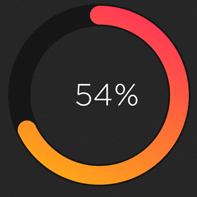

<h2></h2> 
		<h2>⠀Learning DSA(java) from 🧢 <a href="https://github.com/kunal-kushwaha">@kunal-kushwaha</a></h2>
		
			

				
				<a href="https://www.youtube.com/playlist?list=PL9gnSGHSqcnr_DxHsP7AW9ftq0AtAyYqJ">  Youtube Playlist </a>
			

			<h2>⠀Tools  I use :</h2>
			

				
				<a href="https://www.jetbrains.com/idea/">   JetBrains IntelliJ Idea</a>
			

			

				
				<a href="https://code.visualstudio.com/">   Visual Studio Code</a>
			

			

				
				<a href="https://obsidian.md/"> Obsidian</a>
			

			<h2>How to use ?:</h2>
			<ol>
				<li>To clone the repository use <code>git clone https://github.com/driptanil/DSA-Data-Structures-Algorithms</code></li>
				<li>To use Obsidian (because <u><b>GitHub README.md does not support LATEX</b></u> (math equations) 😭) :</li>
				<ul>
					<li>Choose <code>Open Folder as a vault</code>, choose repository folder</li>
					<li>Choose safe mode off (if promoted), because some helpful community plugins are used in Obsidian.</li>
				</ul>
				<li>To use IntelliJ Idea:</li>
				<ul>
					<li>each topic is a project, use <code>Open Project</code> and choose the topic folder</li>
					<li>Java files are stored in `src/com`</li>
				</ul>
				<li>To use Visual Studio Code:
				<ul>
					<li> Java files are stored in <code>`topic`/src/com</code></li>
					<li>remove 1st line <code>package *;</code>(if error while compiling)</li>
				</ul>
			</ol>
 
<h2>⠀Progress: </h2>

			<table>
				<thead align="center">
					<tr border: none;>
						<td>📚Topics</td>
						<td>🏗️Progress</td>
					</tr>
				</thead>
				<tbody>
					<tr>
						<td><a href="https://github.com/driptanil/Data-Structures-Algorithms/tree/main/Java/01-flow-of-program">Flow of Program</a></td>
						<td> </td>
					</tr>
					<tr>
						<td><a href="https://github.com/driptanil/Data-Structures-Algorithms/tree/main/Java/02-first-java">First Java</a></td>
						<td> </td>
					</tr>
					<tr>
						<td><a href="https://github.com/driptanil/Data-Structures-Algorithms/tree/main/Java/03-conditionals-loops">Conditional Loops</a></td>
						<td> </td>
					</tr>
					<tr>
						<td><a href="https://github.com/driptanil/Data-Structures-Algorithms/tree/main/Java/04-functions-methods"> Functions Methods</a></td>
						<td> </td>
					</tr>
					<tr>
						<td><a href="https://github.com/driptanil/Data-Structures-Algorithms/tree/main/Java/05-arrays">Arrays</a></td>
						<td> </td>
					</tr>
					<tr>
						<td><a href="https://github.com/driptanil/Data-Structures-Algorithms/tree/main/Java/06-linear-search">Linear Search</a></td>
						<td> </td>
					</tr>
					<tr>
						<td><a href="https://github.com/driptanil/Data-Structures-Algorithms/tree/main/Java/07-binary-search">Binary Search</a></td>
						<td> </td>
					</tr>
					<tr>
						<td><a href="https://github.com/driptanil/Data-Structures-Algorithms/tree/main/Java/09-bubble-sort">Bubble Sort</a></td>
						<td> </td>
					</tr>
					<tr>
						<td><a href="https://github.com/driptanil/Data-Structures-Algorithms/tree/main/Java/10-selection-sort">Selection Sort</a></td>
						<td> </td>
					</tr>
					<tr>
						<td><a href="https://github.com/driptanil/Data-Structures-Algorithms/tree/main/Java/11-insertion-sort">Insertion Sort</a></td>
						<td> </td>
					</tr>
					<tr>
						<td><a href="https://github.com/driptanil/Data-Structures-Algorithms/tree/main/Java/12-cycle-sort">Cyclic Sort</a></td>
						<td> </td>
					</tr>
					<tr>
						<td><a href="https://github.com/driptanil/Data-Structures-Algorithms/tree/main/Java/13-patterns">Patterns</a></td>
						<td> </td>
					</tr>
					<tr>
						<td><a href="https://github.com/driptanil/Data-Structures-Algorithms/tree/main/Java/14-recursion">Recursion</a></td>
						<td> </td>
					</tr>
					<tr>
						<td><a href="https://github.com/driptanil/Data-Structures-Algorithms/tree/main/Java/15-complexity">Complexity</a></td>
						<td> </td>
					</tr>
					<tr>
						<td><a href="https://github.com/driptanil/Data-Structures-Algorithms/tree/main/Java/16-math-for-dsa">Math Operators</a></td>
						<td> </td>
					</tr>
					<tr>
						<td><a href="https://github.com/driptanil/Data-Structures-Algorithms/tree/main/Java/17-merge-sort">Merge Sort</a></td>
						<td> </td>
					</tr>
					<tr>
						<td><a href="https://github.com/driptanil/Data-Structures-Algorithms/tree/main/Java/18-quick-sort">Quick Sort</a></td>
						<td> </td>
					</tr>
					<tr>
						<td><a href="https://github.com/driptanil/DSA-Data-Structures-Algorithms/tree/main/Java/19-oop">Object Oriented Programming</a></td>
						<td> </td>
					</tr>
					<tr>
						<td><a href="https://github.com/driptanil/DSA-Data-Structures-Algorithms/tree/main/Java/20-linked-list">Linked List</a></td>
						<td> </td>
					</tr>
					<tr>
						<td>Stacks Queues</td>
						<td> </td>
					</tr>
				</tbody>
			</table>
